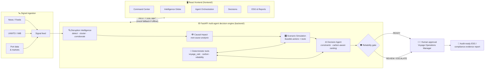

# 🌊 OceanMind — AI Decision Intelligence for Sustainable Maritime Operations

**MAIC Nexus 2026 · Track 6: AI for ESG & SDG** — ESG Reporting · Supply Chain AI · Carbon Tracking · SDG Compliance

Global shipping carries ~90% of world trade and emits ~3% of global CO₂ — and when a
chokepoint like the Red Sea destabilises, operators make USD-million routing decisions
under pressure, by gut feel, with the carbon cost invisible. **OceanMind** is a causal
multi-agent voyage intelligence platform that turns that chaos into one explainable,
carbon-aware recommendation with a full evidence trail and a human approval gate:

> **Detect → Explain → Simulate → Recommend → Approve**

- **Detect** — ingests maritime signals (news, port data, disruption feeds) and clusters them into events with cross-source corroboration.
- **Explain** — builds a causal root-cause analysis so operators see *why*, not just *what*.
- **Simulate** — enumerates feasible actions (continue, reroute, slow-steam, change bunker plan) and prices each with deterministic tools: voyage physics, IMO carbon factors, EU ETS phase-in, FuelEU intensity.
- **Recommend** — hard constraints, then carbon-aware ranking that puts a shadow price on every tonne of CO₂; a reliability gate (READY / REVIEW / ESCALATE / INSUFFICIENT_EVIDENCE) blocks anything without complete evidence.
- **Approve** — a human signs off; every approval generates an audit-ready ESG / compliance evidence report.

## Architecture



## The agents

| Agent | Stage | What it does |
|---|---|---|
| 🔍 Disruption Intelligence | Detect | Signal clustering into disruption events; corroboration scoring |
| 🕸 Causal Impact | Explain | Root-cause analysis, plan-of-record risk decomposition |
| 🎛 Scenario Simulation | Simulate | Enumerates feasible actions and costs each via deterministic tools |
| ⚖️ Decision Agent | Recommend | Hard constraints → carbon-aware ranking → Supplier-DNA bunker optimisation |
| 🧮 Deterministic Tools | Simulate | Haversine voyage calc + speed-cube slow-steaming; IMO CO₂ factors (VLSFO 3.151 tCO₂/t); EU ETS 70%→100% phase-in @ €72/tCO₂e; FuelEU 89.34 gCO₂e/MJ check |
| 🧑‍✈️ Human Approval | Approve | One-click approve / reasoned override; every action lands in the audit trail |

Numbers are never hallucinated: all numbers always come from deterministic tools, never from generated content. The demo has zero external dependencies and runs on golden (replayed) data in the off-the-shelf configuration.

## Quickstart

**Frontend** (works standalone with built-in mock data):

```bash
cd frontend
npm install
npm run dev          # http://localhost:5173
```

**Backend** (optional — upgrades the frontend to live data + real agent runs):

```bash
cd backend
python3 -m venv .venv && source .venv/bin/activate
pip install -r requirements.txt
uvicorn main:app --port 8000     # http://localhost:8000/docs
```

The frontend probes `http://localhost:8000/api/*` and falls back to the golden mock
dataset automatically, so the demo works in any order.

## Demo script — the golden scenario (July 2026)

1. **Login** — `ops@oceanmind.ai` / any password → the OceanMind ops terminal.
2. **Command Center** (`/`) — fleet KPIs, live voyages, the Red Sea disruption burning
   at the top of the feed, CO₂ saved YTD, pending decisions.
3. **Intelligence Globe** (`/globe`) — 40 captured signals on a 3D globe. Click the
   Bab el-Mandeb cluster: security alert, UKMTO SEVERE, war-risk premiums ×4 —
   each with a plain-English readout and what it does **not** imply.
4. **Agent Orchestration** (`/orchestration`) — hit **Run pipeline**. Watch the agents
   pass messages live (SSE): signals clustered → causal analysis built → scenarios costed →
   **Route B: Cape of Good Hope + slow-steam ×2 + bunker shift to Straits Marine Energy**.
   ETA +7.5 d, fuel +USD 182k, ≈USD 400k war-risk avoided, CO₂ penalty halved from +11.8% to **+5.9%**.
   Reliability gate: **READY — evidence complete**.
5. **Approve DEC-0042** (`/decisions/DEC-0042`) — full explainability: rationale,
   3 rejected alternatives with reasons, 8 evidence items, quantified impact. One
   click approves; the audit trail records the human signature.
6. **Export the ESG report** (`/esg`, `/reports`) — the decision-audit evidence pack
   finalises automatically; fleet EU ETS exposure, FuelEU surplus, CII rating, and SDG metrics.

## Track 6 positioning — ESG & SDG

- **Carbon tracking**: every routing option is priced in tCO₂ (IMO factors), EU ETS
  liability and FuelEU intensity *before* the decision is taken — 11,840 tCO₂ avoided
  vs baseline YTD (−7.4%).
- **ESG reporting**: approvals auto-generate audit-ready evidence packs (signals,
  calculations, regulation citations, signatures) for charterers, insurers, verifiers.
- **Supply-chain AI**: Supplier DNA scores bunker suppliers on reliability, ESG,
  alt-fuel readiness — steering demand toward ISCC-certified biofuels.
- **SDG alignment**: SDG 7 (clean marine energy demand), SDG 9 (explainable intelligence for
  critical trade infrastructure), SDG 13 (carbon-aware routing), SDG 14 (less fuel
  burned, less noise, lower whale-strike risk in slow-steam zones).

## Repo layout

```
Oceanmind_2/
├── README.md         this file
├── frontend/         React 18 + Vite + Tailwind — ops terminal UI (9 routes)
└── backend/          FastAPI multi-agent decision engine (see backend/README.md)
```
