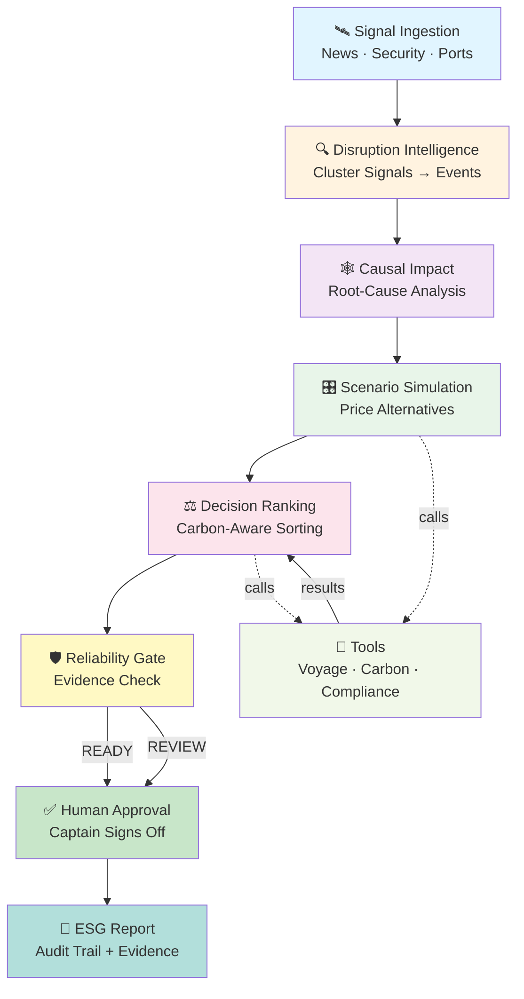
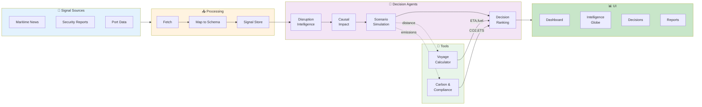
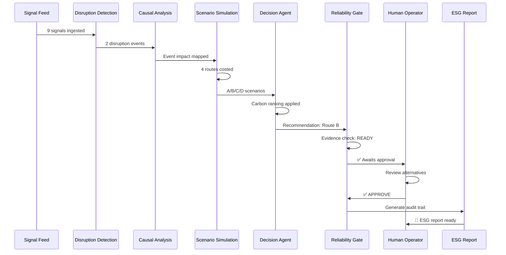

# 🌊 OceanMind — AI Decision Intelligence for Sustainable Maritime Operations

OceanMind is a **causal multi-agent voyage intelligence platform** that turns fragmented disruption signals into explainable, carbon-aware routing decisions with full audit trail and human approval.

## The Problem

Global shipping moves ~90% of world trade but emits ~3% of global CO₂. When a chokepoint destabilizes (Red Sea, Suez, Strait of Hormuz), operators make million-dollar routing decisions **by instinct** with **hidden carbon cost**.

## The Solution

**Six-stage AI pipeline** with human oversight:

1. **Detect** → Cluster disruption signals from news, security, port data
2. **Explain** → Build causal root-cause graph (event → route → voyage → cost)
3. **Simulate** → Enumerate feasible actions, price with deterministic tools
4. **Recommend** → Apply hard constraints, rank by carbon + cost + risk
5. **Approve** → Human operator reviews and signs off
6. **Report** → Audit-ready ESG evidence pack

## 📊 Decision Workflow



## The Golden Scenario

**Red Sea security escalation** affecting MV OceanMind Harmony (Port Klang → Rotterdam)

**Recommendation:** Cape of Good Hope + slow-steam 2 segments + shift bunkering

**Result:**
- ⏱️ ETA +7.5 days | 💰 Fuel +USD 182k | ⚠️ War-risk avoided ≈USD 400k
- 🌍 CO₂ penalty: +11.8% raw → **+5.9% after slow-steaming** | ✅ EU ETS & FuelEU compliant

---

## Quick Start

**Frontend Only** (standalone with mock data):

```bash
cd frontend
npm install
npm run dev          # → http://localhost:5173
```

**With Backend** (live agent runs + real data):

```bash
# Terminal 1: Frontend
cd frontend && npm run dev

# Terminal 2: Backend
cd backend
python3 -m venv .venv && source .venv/bin/activate
pip install -r requirements.txt
uvicorn main:app --port 8000
```

The frontend auto-falls back to mock data if the backend is offline.

## 🏗 System Architecture



## 🤖 Agent Orchestration



## Core Concepts

### Multi-Agent Reasoning
- **Disruption Intelligence** — clusters maritime signals into events with cross-source corroboration
- **Causal Impact** — builds root-cause graph showing event → chokepoint → route impact → voyage cost
- **Scenario Simulation** — enumerates 4–5 feasible actions (continue, reroute, slow-steam, bunker shift) and prices each with deterministic tools
- **Decision Agent** — applies hard constraints, ranks by carbon impact + operational risk + cost + time
- **Reliability Gate** — blocks recommendations unless evidence is complete (READY / REVIEW / ESCALATE)

### Deterministic Pricing
All numbers come from calculation, never AI generation:
- **Voyage** — Haversine distance + speed-cube physics for slow-steaming fuel savings
- **Carbon** — IMO 2023 CO₂ factors (VLSFO 3.151 tCO₂/t) + EU ETS phase-in @ €72/tCO₂e
- **Compliance** — FuelEU intensity (gCO₂e/MJ), CII rating, regulatory thresholds

### Human-In-The-Loop
Every decision requires explicit captain approval. Operators can:
- Review the recommendation rationale
- Inspect source signals and corroboration scores
- Compare rejected alternatives with cost/time/carbon tradeoffs
- Override with a reason (recorded in audit trail)

## Key Features

| Feature | Purpose |
|---------|---------|
| **Signal Clustering** | Ingests news, port data, security reports → identifies disruption events |
| **Causal Analysis** | Builds explainable root-cause DAG so operators see *why* |
| **Deterministic Pricing** | Voyage calc, carbon factors, regulatory checks—never hallucinated |
| **Multi-Scenario Ranking** | Evaluates 4+ routing options ranked by carbon shadow price |
| **Reliability Gate** | Blocks deployment if evidence is incomplete |
| **Human Approval** | Captain signs all decisions; audit trail is immutable |
| **ESG Compliance** | Carbon avoidance, EU ETS liability, evidence pack for verifiers |
| **Real-Time Dashboard** | 3D globe, agent orchestration, live pipeline streaming (SSE) |

## Security

- ✅ Secret detection (pre-commit hooks)
- ✅ Static code analysis (SAST)
- ✅ API rate limiting (120 req/min per IP)
- ✅ Request validation (content checks, XSS/SQLi patterns)
- ✅ Audit logging (all approvals, overrides, timestamps)
- ✅ Security headers (CSP, HSTS, X-Content-Type-Options)

---

**Built for maritime decarbonization and operational resilience.**
